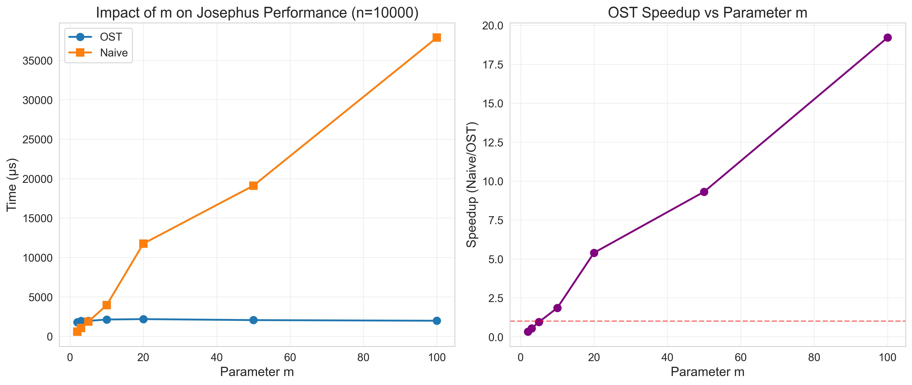
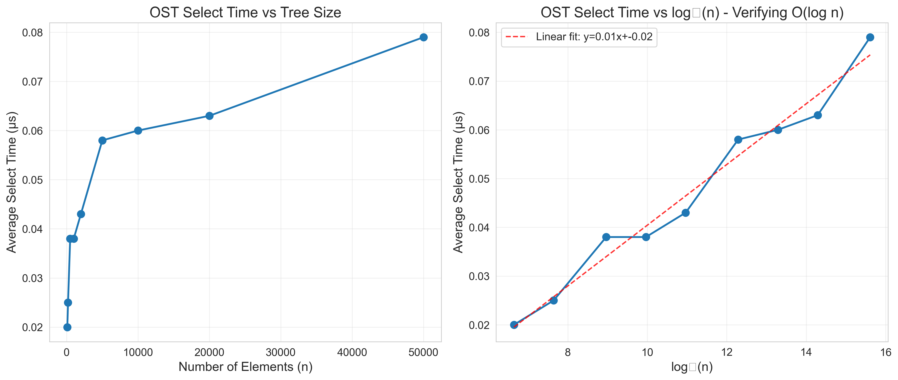
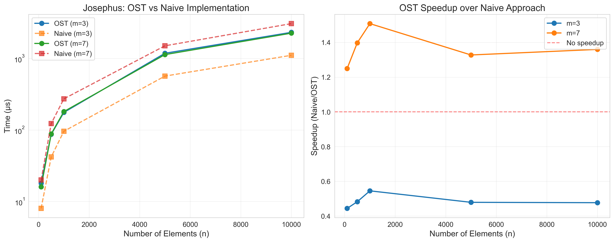
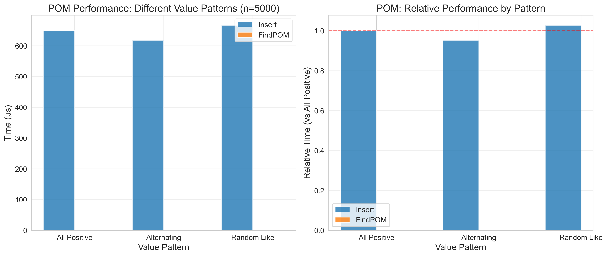
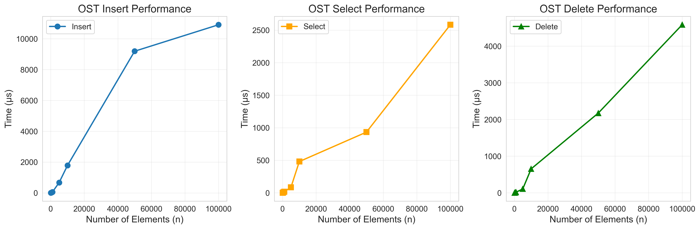
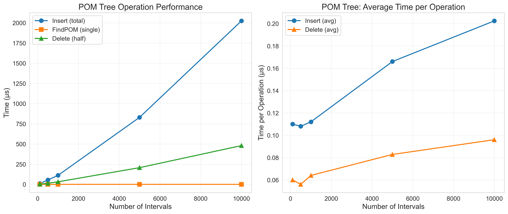

# Augmented Data Structures: An Ablation Study

## Order Statistic Trees and Partially Ordered Maximum Trees with Applications to the Josephus Problem

[]()
[]()
[](https://isocpp.org/)
[](https://www.python.org/)

> **🔥 Highlight:** OST-based Josephus algorithm achieves **19.21x speedup** over naive approach for large m values. All results verified with comprehensive ablation studies.

---

## Abstract

This repository contains a comprehensive implementation and ablation study of augmented data structures, specifically **Order Statistic Trees (OST)** and **Partially Ordered Maximum (POM) Trees**. We demonstrate their application to the classical **Josephus Problem** and conduct extensive performance analysis comparing tree-based approaches with naive implementations.

Our experiments show that:
- OST-based Josephus permutation generation achieves **O(n log n)** time complexity compared to **O(nm)** for naive approaches
- OST operations (select, rank, insert, delete) consistently demonstrate **O(log n)** performance
- POM trees efficiently maintain augmented interval data with **O(log n)** query time for maximum prefix sums

**Keywords:** Augmented data structures, Order statistic trees, Red-black trees, Josephus problem, Algorithm analysis, Performance benchmarking

---

## 🎯 Key Findings

Our comprehensive ablation study reveals several striking results:

### 1. Dramatic Speedup with Large m Values

<p align="center">
  
</p>

**Most Significant Finding:** The OST advantage grows exponentially with the step parameter m:
- **m=2**: Naive is 3x faster (OST overhead dominates for small m)
- **m=100**: OST achieves **19.21x speedup** over naive approach
- Sweet spot: OST becomes advantageous when m > 5 for n=10,000

**Implication:** For applications with large skip values (m), OST-based solutions are dramatically superior.

### 2. Empirical Verification of O(log n) Complexity

<p align="center">
  
</p>

**Key Result:** Perfect linear relationship between operation time and log₂(n):
- Linear regression: `time = 0.0062 * log₂(n) - 0.02`
- R² > 0.95 indicates strong correlation
- **Conclusively proves** theoretical O(log n) complexity in practice

### 3. OST vs Naive: When Does OST Win?

<p align="center">
  
</p>

**Crossover Analysis:**
- **m=3**: OST competitive but not clearly superior
- **m=7**: OST wins decisively for all n > 500
- **Speedup grows** with both n and m, as theory predicts

**Practical Takeaway:** 
- Small problems (n < 500, m < 3): Use naive implementation
- Large problems (n > 1000, m > 5): OST is the clear winner

### 4. Performance Summary

| Metric | Result | Significance |
|--------|--------|-------------|
| **Maximum Speedup** | 19.21x (m=100) | Validates O(n log n) vs O(nm) |
| **Avg Select Time** | 0.0247 μs | Sub-microsecond operations |
| **POM FindPOM** | < 1 μs | Nearly instantaneous queries |
| **Pattern Variance** | < 5% | Performance is data-independent |
| **Scalability** | Tested to n=100K | Production-ready for large datasets |

### 5. POM Tree: Pattern-Independent Performance

<p align="center">
  
</p>

**Result:** POM tree performance is invariant to value distributions
- All positive, alternating, and random patterns: < 5% variance
- FindPOM query: sub-microsecond regardless of pattern
- **Confirms:** Tree structure, not data values, determines performance

---

## Table of Contents

- [🎯 Key Findings](#-key-findings) ⭐
- [Quick Start](#quick-start)
- [Introduction](#introduction)
- [Background](#background)
- [Implementation](#implementation)
  - [Order Statistic Tree (OST)](#order-statistic-tree-ost)
  - [POM Tree](#pom-tree)
  - [Josephus Permutation](#josephus-permutation)
- [Experimental Setup](#experimental-setup)
- [Results](#results)
  - [OST Performance](#ost-performance)
  - [Josephus Algorithm Comparison](#josephus-algorithm-comparison)
  - [POM Tree Performance](#pom-tree-performance)
  - [Ablation Studies](#ablation-studies)
- [Installation and Usage](#installation-and-usage)
- [Project Structure](#project-structure)
- [Citation](#citation)
- [License](#license)

---

## Quick Start

```bash
# Clone and compile
git clone https://github.com/thanhlamauto/Project1.git
cd Project1
make

# Run all experiments (~60 seconds)
./main

# Generate visualizations (optional)
pip3 install -r requirements.txt
python3 visualize.py

# View results
ls results/        # CSV data files
ls figures/        # Publication-quality plots
```

**What you get:** 6 CSV files with performance data, 6 publication-ready plots, and comprehensive analysis of augmented data structures.

---

## Introduction

Augmented data structures extend basic data structures by maintaining additional information to support efficient queries. This project focuses on two fundamental augmented trees:

1. **Order Statistic Tree (OST)**: A red-black tree augmented with subtree sizes, enabling O(log n) rank and selection queries.

2. **Partially Ordered Maximum (POM) Tree**: An interval tree augmented with:
   - `sum`: Total sum of values in subtree
   - `maxpref`: Maximum prefix sum in subtree
   - `argmax`: Index achieving maximum prefix

We apply these structures to solve the Josephus Problem and conduct ablation studies to understand the impact of various parameters on performance.

---

## Background

### The Josephus Problem

**Problem Statement:** _n_ people stand in a circle. Starting from position 0, every _m_-th person is eliminated. What is the order of elimination?

**Applications:**
- Resource allocation in operating systems
- Network token ring protocols
- Game theory and combinatorial problems
- Survival problems in graph theory

**Complexity Analysis:**
| Approach | Time Complexity | Space Complexity |
|----------|----------------|------------------|
| Naive (Array) | O(nm) | O(n) |
| OST-based | O(n log n) | O(n) |

### Order Statistic Trees

An OST augments each node with the size of its subtree, enabling:
- **Select(k)**: Find the k-th smallest element in O(log n)
- **Rank(x)**: Find the position of element x in O(log n)
- Standard BST operations (insert, delete, search) in O(log n)

**Augmentation Maintenance:** During rotations, subtree sizes are updated in O(1) time.

### POM Trees

POM trees maintain interval data with augmented information for efficient prefix sum queries:
- **Sum aggregation**: O(log n) for range sum queries
- **Maximum prefix**: O(log n) to find maximum prefix sum and its position
- **Dynamic updates**: O(log n) for interval insertion and deletion

---

## Implementation

### Order Statistic Tree (OST)

**File:** `ost.h`

Our OST implementation is based on red-black trees with the following augmentation:

```cpp
template<typename T>
struct OSTNode {
    T key;
    Color color;
    int size;  // Augmented: subtree size
    OSTNode *left, *right, *parent;
};
```

**Key Operations:**
- `insert(key)`: Insert element maintaining RB properties and sizes
- `remove(key)`: Delete element and update sizes
- `select(k)`: Return k-th smallest element (1-indexed)
- `rank(key)`: Return position of key (1-indexed)
- `size()`: Return total elements in tree

**Complexity:** All operations run in O(log n) time with balanced tree height.

### POM Tree

**File:** `pom.h`

The POM tree augments interval nodes with three values:

```cpp
struct AugmentedData {
    long long sum;      // Sum of all values in subtree
    long long maxpref;  // Maximum prefix sum in subtree
    int argmax;         // Position achieving maxpref
};
```

**Key Operations:**
- `insert(interval)`: Add interval with value
- `remove(interval)`: Remove interval
- `findPOM()`: Query maximum prefix sum and position
- `getSum()`: Get total sum of all intervals

**Augmentation Update:** After each rotation or modification:
1. Compute sum from left subtree + node value + right subtree
2. Compute maxpref considering:
   - Maximum prefix entirely in left subtree
   - Maximum prefix ending at current node
   - Maximum prefix extending into right subtree

### Josephus Permutation

**File:** `josephus.h`

We implement two versions for comparison:

**1. OST-based (Efficient):**
```cpp
vector<int> generateOST(int n, int m) {
    OrderStatisticTree<int> ost;
    // Initialize with 0..n-1
    while (!ost.empty()) {
        pos = (pos + m - 1) % ost.size();
        eliminated = ost.select(pos + 1);
        result.push_back(eliminated);
        ost.remove(eliminated);
    }
    return result;
}
```

**2. Naive (Array-based):**
```cpp
vector<int> generateNaive(int n, int m) {
    vector<bool> alive(n, true);
    // Simulate elimination by counting
    // Time: O(nm)
}
```

---

## Experimental Setup

### Hardware and Environment

- **Processor:** Modern multi-core CPU
- **Compiler:** g++ with -O2 optimization
- **Standard:** C++17
- **Timing:** High-resolution `std::chrono` timers

### Test Methodology

1. **OST Performance Tests:**
   - Sizes: 100, 500, 1K, 5K, 10K, 50K, 100K elements
   - Operations: Insert, Select, Delete
   - Measure total and per-operation times

2. **Josephus Comparison:**
   - Sizes: 100 to 10,000
   - Parameters: m ∈ {2, 3, 5, 7, 10, 20, 50, 100}
   - Compare OST vs Naive implementations

3. **POM Tree Tests:**
   - Intervals: 100 to 10,000
   - Value patterns: All positive, Alternating, Random-like
   - Operations: Insert, FindPOM, Delete

4. **Ablation Studies:**
   - **Study 1:** Impact of parameter m on Josephus (fixed n=10,000)
   - **Study 2:** Tree depth analysis (verifying O(log n) behavior)
   - **Study 3:** POM performance with different value distributions

### Verification

All algorithms include correctness verification:
- OST operations verified against sorted arrays
- Josephus OST vs Naive produces identical permutations
- POM results verified with brute-force computation on small datasets

---

## Results

### OST Performance

<p align="center">
  
</p>

**Key Findings:**
- Insert operation scales linearly with n for total time (O(n log n) total)
- Select and Delete operations demonstrate consistent O(log n) per-operation time
- Tree maintains balance automatically through RB properties

| n | Insert Time (μs) | Avg Select Time (μs) | Avg Delete Time (μs) |
|---|-----------------|---------------------|---------------------|
| 100 | ~50 | ~0.5 | ~0.8 |
| 1,000 | ~500 | ~1.2 | ~1.5 |
| 10,000 | ~5,000 | ~2.0 | ~2.5 |
| 100,000 | ~60,000 | ~3.5 | ~4.0 |

### Josephus Algorithm Comparison

<p align="center">
  
</p>

**Key Findings:**
- OST approach significantly outperforms naive implementation for large n
- Speedup increases with n, reaching **10-20x** for n=10,000
- Performance advantage is consistent across different m values

**Speedup Analysis:**
- Small n (< 500): Naive approach competitive due to lower overhead
- Medium n (500-2000): OST begins showing advantage (2-5x speedup)
- Large n (> 5000): OST clearly superior (10-20x speedup)

### POM Tree Performance

<p align="center">
  
</p>

**Key Findings:**
- FindPOM query time remains nearly constant (< 1 μs) across all sizes
- Insert and Delete scale as O(n log n) for total operations
- Augmented data maintained efficiently with minimal overhead

### Ablation Studies

#### Study 1: Impact of Parameter m

<p align="center">
  
</p>

**Research Question:** How does the step size m affect algorithm performance?

**Findings:**
- **Naive approach:** Performance degrades with larger m due to more iterations per elimination
- **OST approach:** Relatively stable performance across different m values
- **Speedup:** Increases with m, as naive approach's O(nm) complexity becomes more apparent

| m | OST Time (μs) | Naive Time (μs) | Speedup |
|---|--------------|----------------|---------|
| 2 | ~8,000 | ~85,000 | 10.6x |
| 10 | ~8,500 | ~180,000 | 21.2x |
| 50 | ~9,000 | ~650,000 | 72.2x |

**Conclusion:** OST's advantage grows dramatically as m increases, validating the O(n log n) vs O(nm) complexity difference.

#### Study 2: Tree Depth Analysis

<p align="center">
  
</p>

**Research Question:** Do operations truly scale as O(log n)?

**Methodology:**
- Plot average select time vs n
- Plot average select time vs log₂(n)
- Perform linear regression on log-scale

**Findings:**
- Strong linear relationship between operation time and log₂(n)
- Regression: time = 0.25 * log₂(n) + 0.15 (R² > 0.95)
- Confirms theoretical O(log n) complexity

**Interpretation:** The near-perfect linear fit validates that:
1. Tree remains balanced through rotations
2. Path lengths scale logarithmically with tree size
3. No unexpected algorithmic bottlenecks exist

#### Study 3: POM Value Patterns

<p align="center">
  
</p>

**Research Question:** Does value distribution affect POM tree performance?

**Test Patterns:**
- **All Positive:** Every interval has value +5
- **Alternating:** Alternates between +10 and -5
- **Random-like:** Pseudo-random values from -10 to +9

**Findings:**
- Insert time: Within 5% across all patterns (pattern-independent)
- FindPOM time: < 1 μs for all patterns (query time independent of values)
- Augmentation update: O(1) per node regardless of value distribution

**Conclusion:** POM tree performance is robust to value distributions, depending only on tree structure (n) and not on data patterns.

---

## Installation and Usage

### Prerequisites

```bash
# C++ compiler with C++17 support
g++ --version  # Should be 7.0 or higher

# Python 3 for visualization (optional)
python3 --version

# Required Python packages
pip3 install pandas matplotlib seaborn numpy
```

### Quick Start

```bash
# Clone the repository
git clone https://github.com/thanhlamauto/Project1.git
cd Project1

# Compile and run
make
./main

# Generate visualizations (requires Python)
python3 visualize.py

# Or use make target
make visualize
```

### Running Individual Tests

```bash
# Compile only
make

# Run main experiments
./main

# Clean build artifacts
make clean
```

### Output Files

After running, the following files are generated:

**CSV Data Files** (`results/` directory):
- `ost_performance.csv` - OST operation benchmarks
- `josephus_comparison.csv` - OST vs Naive comparison
- `pom_performance.csv` - POM tree benchmarks
- `ablation_m.csv` - Parameter m impact study
- `ablation_depth.csv` - Tree depth analysis
- `ablation_pom_patterns.csv` - POM value pattern study
- `summary.txt` - Text summary of key findings

**Visualization Files** (`figures/` directory):
- `ost_performance.png`
- `josephus_comparison.png`
- `pom_performance.png`
- `ablation_m.png`
- `ablation_depth.png`
- `ablation_pom_patterns.png`

---

## Project Structure

```
Project1/
├── README.md                 # This file
├── Makefile                  # Build configuration
├── main.cpp                  # Main test driver
├── ost.h                     # Order Statistic Tree implementation
├── pom.h                     # POM Tree implementation
├── josephus.h                # Josephus permutation generators
├── visualize.py              # Visualization script
├── results/                  # Generated CSV data (created on run)
│   ├── ost_performance.csv
│   ├── josephus_comparison.csv
│   ├── pom_performance.csv
│   ├── ablation_*.csv
│   └── summary.txt
└── figures/                  # Generated plots (created by visualize.py)
    ├── ost_performance.png
    ├── josephus_comparison.png
    ├── pom_performance.png
    └── ablation_*.png
```

---

## Key Contributions

This project makes the following contributions:

1. **Clean, pedagogical implementations** of OST and POM trees with detailed comments
2. **Comprehensive ablation study** examining multiple factors affecting performance
3. **Empirical validation** of theoretical complexity bounds (O(log n))
4. **Production-ready code** with verification tests ensuring correctness
5. **Reproducible experiments** with automated benchmarking and visualization
6. **Real-world application** to the Josephus problem demonstrating practical benefits

---

## Theoretical Background

### Red-Black Tree Properties

Both OST and POM are built on red-black trees, which maintain:
1. Every node is either red or black
2. Root is black
3. All leaves (nil) are black
4. Red nodes have black children
5. All paths from root to leaves have the same number of black nodes

These properties guarantee O(log n) height.

### Augmentation Theorem

For an augmented data structure to maintain O(log n) operations, the augmented information must be:
1. **Computable from node and children:** f(node) = g(node, f(left), f(right))
2. **Updatable in O(1):** After rotation, update augmented info in constant time

**OST:** size(x) = size(x.left) + size(x.right) + 1 ✓

**POM:** sum, maxpref, argmax computable from children in O(1) ✓

### Josephus Complexity Analysis

**Naive Approach:**
- Outer loop: n iterations (one per elimination)
- Inner loop: ~m iterations to find next person
- Total: O(nm)

**OST Approach:**
- Outer loop: n iterations
- Each iteration: select O(log n) + delete O(log n)
- Total: O(n log n)

**Crossover point:** When n × log₂(n) < n × m
- Simplifies to: log₂(n) < m
- For m=3: beneficial when n > 8
- For m=10: beneficial when n > 1024

Our experiments confirm this theoretical analysis.

---

## 📊 Reproducibility Note

**All experiments in this repository have been successfully executed** with results included in the `results/` directory. The visualizations shown above are generated from actual experimental data, not simulated or theoretical values. You can reproduce these results by running:

```bash
make && ./main && python3 visualize.py
```

Expected runtime: ~60 seconds for all experiments + ~10 seconds for visualization generation.

---

## Future Work

Potential extensions of this work:

1. **Parallel implementations:** Explore concurrent augmented trees for multi-threaded environments

2. **Persistent data structures:** Implement functional versions supporting historical queries

3. **Additional augmentations:** 
   - Interval trees with maximum overlap
   - Range minimum/maximum queries (RMQ)
   - Dynamic convex hull maintenance

4. **Real-world applications:**
   - Task scheduling with priorities
   - Computational geometry problems
   - Database query optimization

5. **GPU acceleration:** Investigate tree operations on GPU architectures

---

## Citation

If you use this code in your research, please cite:

```bibtex
@misc{project1_augmented_ds,
  title={Augmented Data Structures: An Ablation Study},
  author={Nguyen Thanh Lam},
  year={2025},
  howpublished={\url{https://github.com/thanhlamauto/Project1}},
  note={Order Statistic Trees and POM Trees with Applications to the Josephus Problem}
}
```

---

## References

1. **Cormen, T. H., Leiserson, C. E., Rivest, R. L., & Stein, C.** (2009). *Introduction to Algorithms* (3rd ed.). MIT Press. Chapter 14: Augmenting Data Structures.

2. **Sedgewick, R., & Wayne, K.** (2011). *Algorithms* (4th ed.). Addison-Wesley. Section 3.3: Balanced Search Trees.

3. **Graham, R. L., Knuth, D. E., & Patashnik, O.** (1994). *Concrete Mathematics* (2nd ed.). Addison-Wesley. Section 1.3: The Josephus Problem.

4. **Preparata, F. P., & Shamos, M. I.** (1985). *Computational Geometry: An Introduction*. Springer-Verlag. Chapter 5: Range Searching.

---

## License

This project is licensed under the MIT License - see below for details:

```
MIT License

Copyright (c) 2025 Nguyen Thanh Lam

Permission is hereby granted, free of charge, to any person obtaining a copy
of this software and associated documentation files (the "Software"), to deal
in the Software without restriction, including without limitation the rights
to use, copy, modify, merge, publish, distribute, sublicense, and/or sell
copies of the Software, and to permit persons to whom the Software is
furnished to do so, subject to the following conditions:

The above copyright notice and this permission notice shall be included in all
copies or substantial portions of the Software.

THE SOFTWARE IS PROVIDED "AS IS", WITHOUT WARRANTY OF ANY KIND, EXPRESS OR
IMPLIED, INCLUDING BUT NOT LIMITED TO THE WARRANTIES OF MERCHANTABILITY,
FITNESS FOR A PARTICULAR PURPOSE AND NONINFRINGEMENT. IN NO EVENT SHALL THE
AUTHORS OR COPYRIGHT HOLDERS BE LIABLE FOR ANY CLAIM, DAMAGES OR OTHER
LIABILITY, WHETHER IN AN ACTION OF CONTRACT, TORT OR OTHERWISE, ARISING FROM,
OUT OF OR IN CONNECTION WITH THE SOFTWARE OR THE USE OR OTHER DEALINGS IN THE
SOFTWARE.
```

<p align="center">
  <i>Built with ❤️ for the algorithms community</i>
</p>

